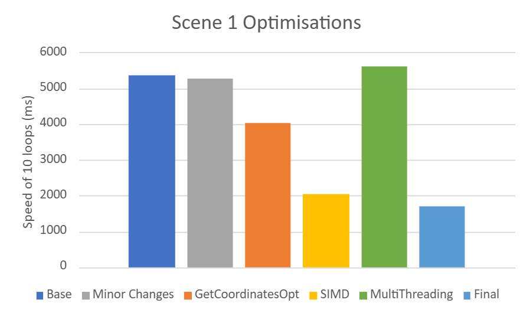
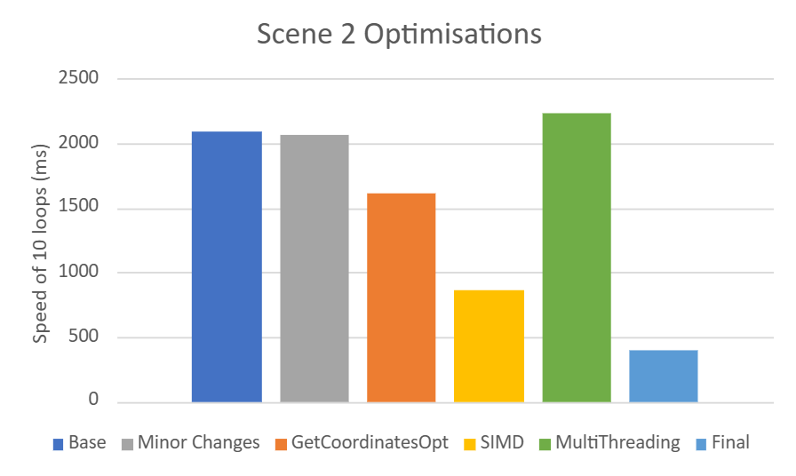
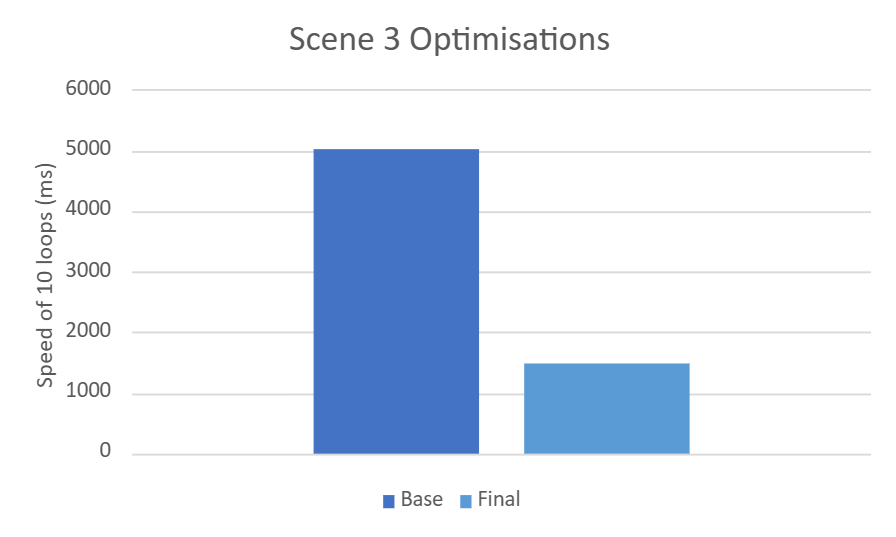
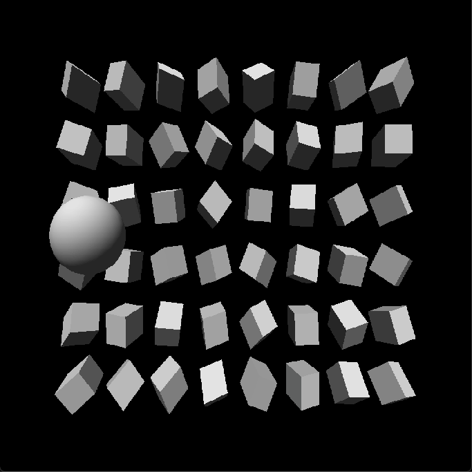
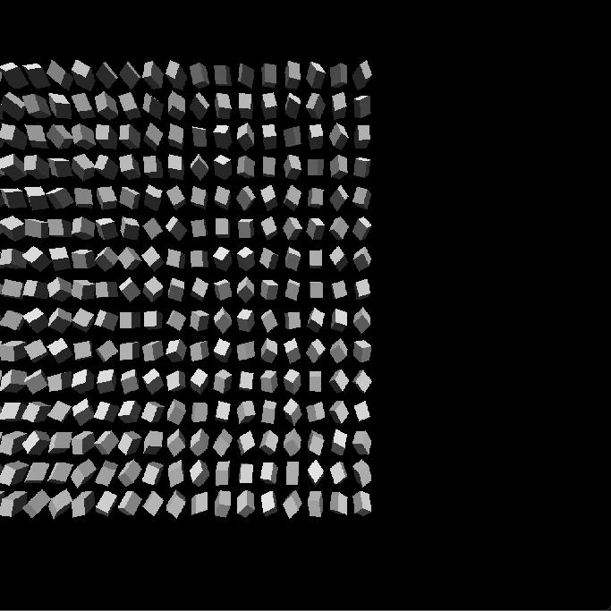

# Software Rasteriser Optimisation

A CPU software rasteriser optimised for performance, reaching **3 to 5x speedups** through SIMD vectorisation, multithreading, and cache-aware restructuring. Written in C++20.

## Performance

| Scene 1 | Scene 2 | Scene 3 |
|:---:|:---:|:---:|
|  |  |  |

## Output

| Scene 1 | Scene 2 | Scene 3 |
|:---:|:---:|:---:|
|  |  |  |

## Results

| Scene | Baseline (ms) | Optimised (ms) | Speedup |
|---|---|---|---|
| Scene 1 | 5364 | 1707 | 3.14x |
| Scene 2 | 2091 | 399 | 5.24x |
| Scene 3 | 5020 | 1472 | 3.41x |

## Approach

- **Profiled first** to find the hotspots, then optimised them in priority order rather than guessing.
- **AVX2 SIMD** vectorisation of the per-pixel and per-vertex hot paths.
- **Multithreading** with `std::jthread` across screen regions.
- **Cache-friendly** data restructuring, branch early-exits, and unrolled matrix math.

## Tech stack

C++20 · AVX2 · std::jthread

## Full technical write-up

The full breakdown of each optimisation and its measured impact is in
[docs/rasteriser_TECHNICAL.md](docs/rasteriser_TECHNICAL.md).

