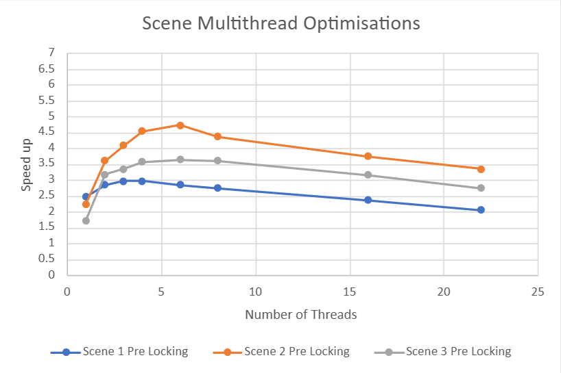
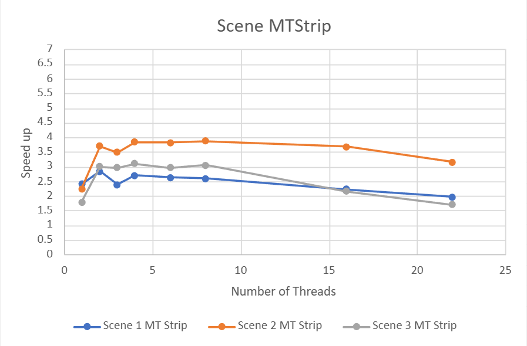
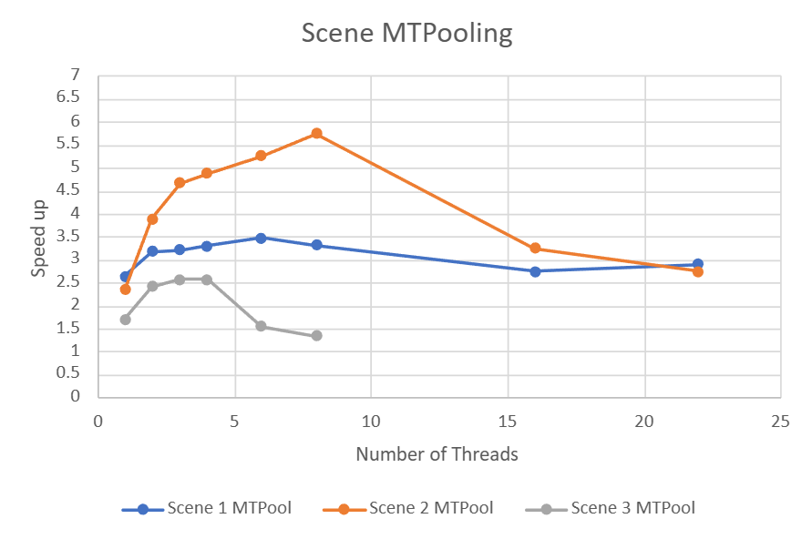

# Optimising a CPU Rasteriser: Technical Write-Up

Profiler-driven optimisation of a provided software rasteriser, reaching **3.14x to 5.24x** speedups across three test scenes. Written in C++20 with AVX2 intrinsics and `std::jthread`. The rasteriser itself was supplied; the optimisation work is mine.

## Results

| Scene | Baseline (10 loops) | Speedup |
|---|---|---|
| Scene 1 | 5407.17 ms | **3.14x** |
| Scene 2 | 2125.08 ms | **5.24x** |
| Scene 3 | 5019.74 ms | **3.41x** |

Baselines were averaged over 50 loops, with a maximum run-to-run variation of 4.91% (scene 1) and 6.20% (scene 2).

**Per-scene optimisation results**
| Scene 1 | Scene 2 | Scene 3 |
|:---:|:---:|:---:|
|  |  |  |

## Approach

Each optimisation was measured in isolation before being kept, working in four stages: algorithmic and structural cleanup, targeted optimisation of the profiler's hottest function, SIMD vectorisation, and multithreading.

## 1. Structural and algorithmic changes

The first pass targeted cheap wins that compound:

- **Unrolled the 4x4 matrix multiply**, removing loop overhead from a call made constantly during transformation.
- **Reduced redundant variable creation**, particularly repeated construction of the same `vec2D` objects.
- **Replaced division with multiplication** on hot paths. In `getCoordinates`, three divisions by `area` became a single reciprocal multiplied three times:

```cpp
// before: three divisions per call
alpha = getC(vec2D(v[0].p), vec2D(v[1].p), p) / area;

// after: one reciprocal, three multiplies
const float invArea = 1.0f / area;
alpha = getC(v0p, v1p, p) * invArea;
```

## 2. Profiling: finding the real hotspot

Rather than guessing, I profiled the renderer to locate the actual cost. `getCoordinates`, called from inside the draw loop, dominated: **41.36% of CPU time in scene 1** (24,758 samples) and **45.32% in scene 2** (10,228 samples).

Two problems were visible in the function. The same vertex positions were being reconstructed on every call, and all three barycentric coordinates were computed before any rejection test ran, even though a single negative value is enough to reject the pixel.

The fix caches each point once and **exits early** on the first negative coordinate:

```cpp
bool getCoordinatesOptimised(vec2D& p, float& alpha, float& beta, float& gamma) {
    const vec2D v0p = vec2D(v[0].p);
    const vec2D v1p = vec2D(v[1].p);
    const vec2D v2p = vec2D(v[2].p);

    const float invArea = 1.0f / area;

    alpha = getC(v0p, v1p, p) * invArea;
    if (alpha < 0.f) return false;
    beta = getC(v1p, v2p, p) * invArea;
    if (beta < 0.f) return false;
    gamma = getC(v2p, v0p, p) * invArea;
    if (gamma < 0.f) return false;

    return true;
}
```

Re-profiling confirmed the effect: the function's share of CPU time dropped to **29.79%** and **34.00%**, with sample counts roughly halved, for an immediate **25% overall performance gain**.

## 3. SIMD vectorisation

The largest single improvement came from vectorising the draw call with AVX2, processing **eight pixels per iteration** and giving a **60% speedup over the baseline**.

The barycentric test was rewritten to compute all three coordinates for eight pixels at once and combine the sign tests into a single mask, avoiding per-pixel branching entirely:

```cpp
__m256 test_alpha = _mm256_cmp_ps(alpha, zero, _CMP_GE_OQ);
__m256 test_beta  = _mm256_cmp_ps(beta,  zero, _CMP_GE_OQ);
__m256 test_gamma = _mm256_cmp_ps(gamma, zero, _CMP_GE_OQ);

__m256 inside_mask = _mm256_and_ps(_mm256_and_ps(test_alpha, test_beta), test_gamma);
```

A matching SIMD interpolation helper was needed for colour and lighting. One subtlety: the interpolation had to be ordered beta, gamma, alpha to match the original code's vertex convention, otherwise shading came out wrong.

Because branching per pixel disappears under SIMD, the early-exit logic from stage 2 was folded into the vectorised path rather than kept as-is.

## 4. Multithreading

Parallelism was added at the draw call inside `render`. Two thresholds came out of testing: roughly **150 triangles per thread** gave the best throughput, and scenes under **200 triangles** skip threading entirely, since the setup cost outweighs the gain.

```cpp
size_t triangleCount = jobs.size();
if (triangleCount < 200) {
    for (auto& job : jobs)
        job.tri.drawSIMDOptimised(renderer, L, job.ka, job.kd);
    return;
}

unsigned int numThreads = std::min(
    (unsigned int)std::jthread::hardware_concurrency(),
    (unsigned int)triangleCount / 150);
```

To benchmark thread scaling honestly, I built a dedicated scene sized to saturate the thread pool: a 15x18 grid of independently spinning cubes totalling 3,240 triangles, with a moving camera so some cubes leave the frustum. At 22 threads that gives about 147 triangles each.

I then compared four strategies, measured across thread counts:

| Strategy | Idea |
|---|---|
| Plain multithreading | Threads created per frame, interleaved triangle assignment |
| Strip allocation | Each thread owns a horizontal band of the canvas |
| Thread pooling | Persistent pool, removing per-frame thread creation cost |
| Pooling + strips | Both combined |

| MultiThread | MT Strip |
|:---:|:---:|
|  |  |
| **MT Pool** | **MT Strip & Pool** |
|  |  |

## What the threading results actually showed

The scaling results were less predictable than expected, and this is the most interesting part of the project.

Thread pooling removed the per-frame cost of creating and destroying threads and produced the single best result in the set: **5.6x on scene 2 at 8 threads**. But the same change made **scene 3 substantially worse**, which points to the workload rather than the mechanism being the deciding factor.

Strip allocation flattened the scaling curve, which was the intent, but it achieved this by lifting the high thread counts up to the level of the low ones rather than raising the peak. Comparing the plain and strip charts, the curve is more level but no faster overall.

Across every configuration, throughput peaked at a low thread count and then declined as threads were added. My working explanation is the `waitForCompletion` barrier, which forces all threads to sync before the frame completes, so the slowest thread gates the frame and adding threads increases the chance of an unlucky straggler.

## Conclusions

**SIMD was the highest-value optimisation by a clear margin**, delivering more in one change than any other single step, and it is the first thing I would reach for again on CPU-bound pixel work.

**Profiling before optimising was what made the rest efficient.** The `getCoordinates` work was worth 25% precisely because measurement identified it, rather than optimising by intuition.

**Multithreading was the weakest return relative to effort**, and I would want to remove the completion barrier and investigate work-stealing or finer-grained job scheduling before drawing firm conclusions about the ceiling.

One methodological lesson: partway through, I realised benchmarks should run from a fresh restart with only the IDE open. Background processes introduced enough variance to muddy small differences, and controlling for that earlier would have made the marginal results easier to interpret.

## Tech stack

C++20 · AVX2 SIMD intrinsics · `std::jthread` · Visual Studio profiler
